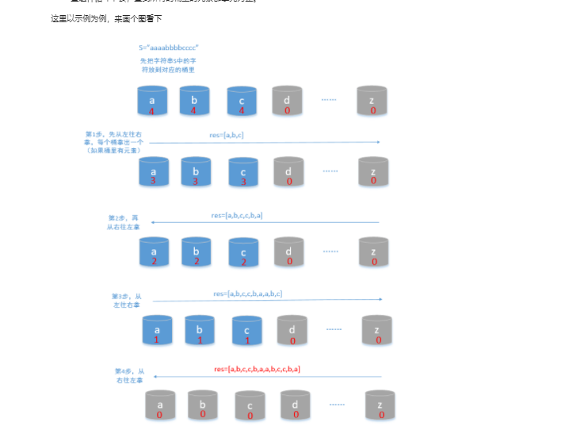

# LeetCode代码记录过程 以及解题思路

## 2020.10.19

~~~java
// 给定一个整数数组 nums 和一个目标值 target，请你在该数组中找出和为目标值的那 两个 整数，并返回他们的数组下标。
//
// 你可以假设每种输入只会对应一个答案。但是，数组中同一个元素不能使用两遍。
//
//
//
// 示例:
//
// 给定 nums = [2, 7, 11, 15], target = 9
//
// 因为 nums[0] + nums[1] = 2 + 7 = 9
// 所以返回 [0, 1]
//
// Related Topics 数组 哈希表
// 👍 9390 👎 0

### 解题思路
此处撰写解题思路
思路类似冒泡排序 1+2 比较结果  1+3 1+n 2+3 .....
总之就是循环遍历出结果 
更好的写法
####
    class Solution {
    public int[] twoSum(int[] nums, int target) {
        Map<Integer, Integer> hashtable = new HashMap<Integer, Integer>();
        for (int i = 0; i < nums.length; ++i) {
            if (hashtable.containsKey(target - nums[i])) {
                return new int[]{hashtable.get(target - nums[i]), i};
            }
            hashtable.put(nums[i], i);
        }
        return new int[0];
    }
}
    
### 代码

```java
 class Solution {
    public   int[] twoSum(int[] nums, int target) {
        int[] array =new int[2];
        List<Integer> list = new ArrayList<>();
        for (int i = 0; i < nums.length; i++) {
            for (int j = i + 1; j < nums.length ;j++) {
                if (nums[i] + nums[j] == target) {
                    array[0]=i;
                    array[1]=j;

                }
            }
        }
        return  array;
    }
  }
```
~~~


## 2020.10.20

```java
//给定一个单链表 L：L0→L1→…→Ln-1→Ln ，
//将其重新排列后变为： L0→Ln→L1→Ln-1→L2→Ln-2→…

//你不能只是单纯的改变节点内部的值，而是需要实际的进行节点交换。

//示例 1:

//给定链表 1->2->3->4, 重新排列为 1->4->2->3.
示例 2:
//
//给定链表 1->2->3->4->5, 重新排列为 1->5->2->4->3.

解答：
    /**
 * Definition for singly-linked list.
 * public class ListNode {
 *     int val;
 *     ListNode next;
 *     ListNode() {}
 *     ListNode(int val) { this.val = val; }
 *     ListNode(int val, ListNode next) { this.val = val; this.next = next; }
 * }
 */
class Solution {
   public void reorderList(ListNode head) {
        if (head == null) {
            return;
        }
        List<ListNode> list = new ArrayList<ListNode>();
        ListNode node = head;
        while (node != null) {
            list.add(node);
            node = node.next;
        }
        int i = 0, j = list.size() - 1;
        while (i < j) {
            list.get(i).next = list.get(j);
            i++;
            if (i == j) {
                break;
            }
            list.get(j).next = list.get(i);
            j--;
        }
        list.get(i).next = null;
}
}
```

## 2020.10.21

```java
你的朋友正在使用键盘输入他的名字 name。偶尔，在键入字符 c 时，按键可能会被长按，而字符可能被输入 1 次或多次。

你将会检查键盘输入的字符 typed。如果它对应的可能是你的朋友的名字（其中一些字符可能被长按），那么就返回 True。

 

示例 1：

输入：name = "alex", typed = "aaleex"
输出：true
解释：'alex' 中的 'a' 和 'e' 被长按。
示例 2：

输入：name = "saeed", typed = "ssaaedd"
输出：false
解释：'e' 一定需要被键入两次，但在 typed 的输出中不是这样。
示例 3：

输入：name = "leelee", typed = "lleeelee"
输出：true
示例 4：

输入：name = "laiden", typed = "laiden"
输出：true
解释：长按名字中的字符并不是必要的。
 

提示：

name.length <= 1000
typed.length <= 1000
name 和 typed 的字符都是小写字母。
    
    解题思路：比较每个字母是否一样 一样 指针后移 不一样就拿此指针Type与前一个指针Type字母相比  如果相同代表键入 j++
    不同代表错误 直接返会false
*******************************************************************
    class Solution {
    public boolean isLongPressedName(String name, String typed) {
     
 int i = 0, j = 0;
 while(j<typed.length()){
     if(i<name.length()&& name.charAt(i)==typed.charAt(j)){
         j++;
         i++;
     }else if(j>0&&typed.charAt(j)==typed.charAt(j-1)){
         j++;
     }else{
         return false;
     }
 }
 return i==name.length();
    
    }
}


```

## 2020.10.22

```
字符串 S 由小写字母组成。我们要把这个字符串划分为尽可能多的片段，同一个字母只会出现在其中的一个片段。返回一个表示每个字符串片段的长度的列表。

 

示例 1：

输入：S = "ababcbacadefegdehijhklij"
输出：[9,7,8]
解释：
划分结果为 "ababcbaca", "defegde", "hijhklij"。
每个字母最多出现在一个片段中。
像 "ababcbacadefegde", "hijhklij" 的划分是错误的，因为划分的片段数较少。
 

提示：

S的长度在[1, 500]之间。
S只包含小写字母 'a' 到 'z' 。
通过次数30,195提交次数40,252

//解题思路
先查询出每个字母最后出现的下标
然后for循环遍历判断每个数字下标 例如 end=8 则之前数字b的最后出现下标为5 则b一定在此下标[0 8]之间 直到遍历到end则 此下标为分段下标
***********************************************************************************************
class Solution {
   
    public static List<Integer> partitionLabels(String S) {
        int[] last = new int[26];
        int length = S.length();
        for (int i = 0; i < length; i++) {
            last[S.charAt(i) - 'a'] = i;
        }
        System.out.println(Arrays.toString(last));
        List<Integer> partition = new ArrayList<Integer>();
        int start = 0, end = 0;
        for (int i = 0; i < length; i++) {
            end = Math.max(end, last[S.charAt(i) - 'a']);

            if (i == end) {  // 若 相等，则之前的所有元素，都仅在 i之前出现，可以记录结果
                partition.add(end - start + 1);
                start = end + 1;
            }
        }
        return partition;
    }
}

```

## 2020.10.23

```
请判断一个链表是否为回文链表。

示例 1:

输入: 1->2
输出: false
示例 2:

输入: 1->2->2->1
输出: true
**********************************************************************************************
解题目思路 利用list 和栈来解决问题 栈是先进后出

/**
 * Definition for singly-linked list.
 * public class ListNode {
 *     int val;
 *     ListNode next;
 *     ListNode(int x) { val = x; }
 * }
 */
class Solution {
      public  boolean isPalindrome(ListNode head) {
        Stack<Integer> stack = new Stack<>();
            List<Integer> list = new ArrayList();
            while (head!= null) {
                list.add(head.val);
                stack.push(head.val);
                head = head.next;
            }

            for (Integer i : list) {
                Integer pop = stack.pop();
                if (!i.equals(pop)) {
                    return false;
                }
            }
                    return true;
        }
}

```

## 2020.10.25

```
给你一个数组 nums，对于其中每个元素 nums[i]，请你统计数组中比它小的所有数字的数目。

换而言之，对于每个 nums[i] 你必须计算出有效的 j 的数量，其中 j 满足 j != i 且 nums[j] < nums[i] 。

以数组形式返回答案。

 

示例 1：

输入：nums = [8,1,2,2,3]
输出：[4,0,1,1,3]
解释： 
对于 nums[0]=8 存在四个比它小的数字：（1，2，2 和 3）。 
对于 nums[1]=1 不存在比它小的数字。
对于 nums[2]=2 存在一个比它小的数字：（1）。 
对于 nums[3]=2 存在一个比它小的数字：（1）。 
对于 nums[4]=3 存在三个比它小的数字：（1，2 和 2）。
示例 2：

输入：nums = [6,5,4,8]
输出：[2,1,0,3]
示例 3：

输入：nums = [7,7,7,7]
输出：[0,0,0,0]
 

提示：

2 <= nums.length <= 500
0 <= nums[i] <= 100
***********************************************************************************************
暴力解题思路循环遍历
class Solution {
    public  int[] smallerNumbersThanCurrent(int[] nums) {
        int [] num= new int[nums.length];
        for (int i= 0 ;i<nums.length;i++){
            int size =nums.length-1;
            while (size!=-1){
                if (nums[i]>nums[size]){
                    num[i]++;
                }
             size--;
            }
        }
        return num;
    }
}
***********************************************************************************************
巧妙思路 快排遍历

```

## 2020.10.26

```java
给你一个整数数组 arr，请你帮忙统计数组中每个数的出现次数。

如果每个数的出现次数都是独一无二的，就返回 true；否则返回 false。

 

示例 1：

输入：arr = [1,2,2,1,1,3]
输出：true
解释：在该数组中，1 出现了 3 次，2 出现了 2 次，3 只出现了 1 次。没有两个数的出现次数相同。
示例 2：

输入：arr = [1,2]
输出：false
示例 3：

输入：arr = [-3,0,1,-3,1,1,1,-3,10,0]
输出：true
 

提示：

1 <= arr.length <= 1000
-1000 <= arr[i] <= 1000
********************************************************************************************
//entry 是存放map的key value值得
    //getOrDefault()方法是获取默认值 
    // occur.put(x, occur.getOrDefault(x, 0) + 1);
    如果没有默认值为0 如果有就加1
     // map变成 entryset 就可以x获取其中值 
********************************************************************************************
  class Solution {
   public  boolean uniqueOccurrences ( int[] arr){
        Map<Integer, Integer> occur = new HashMap<Integer, Integer>();
        for (int x : arr) {
            occur.put(x, occur.getOrDefault(x, 0) + 1);
        }
        Set<Integer> times = new HashSet<Integer>();
        for (Map.Entry<Integer, Integer> x : occur.entrySet()) {
            System.out.println(occur.entrySet());
            times.add(x.getValue());
            System.out.println(times);
        }
        return times.size() == occur.size();
    }
}

```

## 2020.10.27

```
给定一个二叉树，它的每个结点都存放一个 0-9 的数字，每条从根到叶子节点的路径都代表一个数字。

例如，从根到叶子节点路径 1->2->3 代表数字 123。

计算从根到叶子节点生成的所有数字之和。

说明: 叶子节点是指没有子节点的节点。

示例 1:

输入: [1,2,3]
    1
   / \
  2   3
输出: 25
解释:
从根到叶子节点路径 1->2 代表数字 12.
从根到叶子节点路径 1->3 代表数字 13.
因此，数字总和 = 12 + 13 = 25.
示例 2:

输入: [4,9,0,5,1]
    4
   / \
  9   0
 / \
5   1
输出: 1026
解释:
从根到叶子节点路径 4->9->5 代表数字 495.
从根到叶子节点路径 4->9->1 代表数字 491.
从根到叶子节点路径 4->0 代表数字 40.
因此，数字总和 = 495 + 491 + 40 = 1026.
********************************************************************************************
解题思路：
不用管叶子结点如何生成，即判断左右节点数  需要利用i*10 递归回溯调用。
********************************************************************************************

/**
 * Definition for a binary tree node.
 * public class TreeNode {
 *     int val;
 *     TreeNode left;
 *     TreeNode right;
 *     TreeNode(int x) { val = x; }
 * }
 */
class Solution {
      public int sumNumbers(TreeNode root) {
        return helper(root, 0);
    }
public static int helper(TreeNode root,int i){
    if(root==null)return 0;
    int temp =i*10+root.val;
    if(root.left==null&&root.right==null){
        return temp;
    }
    return helper(root.left,temp)+helper(root.right,temp);
}


}
```

## 2020.11.2

```java
给定两个数组，编写一个函数来计算它们的交集。

 

示例 1：

输入：nums1 = [1,2,2,1], nums2 = [2,2]
输出：[2]
示例 2：

输入：nums1 = [4,9,5], nums2 = [9,4,9,8,4]
输出：[9,4]
 

说明：

输出结果中的每个元素一定是唯一的。
我们可以不考虑输出结果的顺序。

***********************************************************************************************
解题思路 可以双指针遍历 可以循环遍历 也可以stream流式遍历
***********************************************************************************************
class Solution {
   public int[] intersection(int[] nums1, int[] nums2) {
    // int[] 转为 List
    List<Integer> l1 = Arrays.stream(nums1).boxed().collect(Collectors.toList());
    // 过滤，只保留并集元素 筛选一样的
    List<Integer> l2 = Arrays.stream(nums2).filter(n -> l1.contains(n)).distinct()
            .boxed().collect(Collectors.toList());
    // List 转为 int[]
    return l2.stream().mapToInt(Integer::valueOf).toArray();
}
}
```

## 2020.11.3

```
给定一个整数数组 A，如果它是有效的山脉数组就返回 true，否则返回 false。

让我们回顾一下，如果 A 满足下述条件，那么它是一个山脉数组：

A.length >= 3
在 0 < i < A.length - 1 条件下，存在 i 使得：
A[0] < A[1] < ... A[i-1] < A[i]
A[i] > A[i+1] > ... > A[A.length - 1]
 


 

示例 1：

输入：[2,1]
输出：false
示例 2：

输入：[3,5,5]
输出：false
示例 3：

输入：[0,3,2,1]
输出：true

```

### 解题思路


```java
class Solution {
 public boolean validMountainArray(int[] A) {
        int len = A.length;
        int left = 0;
        int right = len - 1;
        //从左边往右边找，一直找到山峰为止
        while (left + 1 < len && A[left] < A[left + 1])
            left++;
        //从右边往左边找，一直找到山峰为止
        while (right > 0 && A[right - 1] > A[right])
            right--;
        //判断从左边和从右边找的山峰是不是同一个
        return left > 0 && right < len - 1 && left == right;
    }

}
```

## 2020.11.4

```java
给出一个无重叠的 ，按照区间起始端点排序的区间列表。

在列表中插入一个新的区间，你需要确保列表中的区间仍然有序且不重叠（如果有必要的话，可以合并区间）。

 

示例 1：

输入：intervals = [[1,3],[6,9]], newInterval = [2,5]
输出：[[1,5],[6,9]]
示例 2：

输入：intervals = [[1,2],[3,5],[6,7],[8,10],[12,16]], newInterval = [4,8]
输出：[[1,2],[3,10],[12,16]]
解释：这是因为新的区间 [4,8] 与 [3,5],[6,7],[8,10] 重叠。
***********************************************************************************************
 解体思路  新的区间是否和原来区间重复 不重复情况 新区间起始位置大于原区间最大值 或者 新区间末尾值 小于原来的起始位置。
***********************************************************************************************


class Solution {
    public int[][] insert(int[][] intervals, int[] newInterval) {
        int left = newInterval[0];
        int right = newInterval[1];
        boolean placed = false;
        List<int[]> ansList = new ArrayList<int[]>();
        for (int[] interval : intervals) {
            if (interval[0] > right) {
                // 在插入区间的右侧且无交集
                if (!placed) {
                    ansList.add(new int[]{left, right});
                    placed = true;                    
                }
                ansList.add(interval);
            } else if (interval[1] < left) {
                // 在插入区间的左侧且无交集
                ansList.add(interval);
            } else {
                // 与插入区间有交集，计算它们的并集
                left = Math.min(left, interval[0]);
                right = Math.max(right, interval[1]);
            }
        }
        if (!placed) {
            ansList.add(new int[]{left, right});
        }
        int[][] ans = new int[ansList.size()][2];
        for (int i = 0; i < ansList.size(); ++i) {
            ans[i] = ansList.get(i);
        }
        return ans;
    }
}


```

## 2020.11.5

```java
给你一个整数数组 arr 。请你将数组中的元素按照其二进制表示中数字 1 的数目升序排序。

如果存在多个数字二进制中 1 的数目相同，则必须将它们按照数值大小升序排列。

请你返回排序后的数组。

 

示例 1：

输入：arr = [0,1,2,3,4,5,6,7,8]
输出：[0,1,2,4,8,3,5,6,7]
解释：[0] 是唯一一个有 0 个 1 的数。
[1,2,4,8] 都有 1 个 1 。
[3,5,6] 有 2 个 1 。
[7] 有 3 个 1 。
按照 1 的个数排序得到的结果数组为 [0,1,2,4,8,3,5,6,7]
示例 2：

输入：arr = [1024,512,256,128,64,32,16,8,4,2,1]
输出：[1,2,4,8,16,32,64,128,256,512,1024]
解释：数组中所有整数二进制下都只有 1 个 1 ，所以你需要按照数值大小将它们排序。
示例 3：

输入：arr = [10000,10000]
输出：[10000,10000]
示例 4：

输入：arr = [2,3,5,7,11,13,17,19]
输出：[2,3,5,17,7,11,13,19]
示例 5：

输入：arr = [10,100,1000,10000]
输出：[10,100,10000,1000]
 

提示：

1 <= arr.length <= 500
0 <= arr[i] <= 10^4
通过次数23,319提交次数31,841


//大佬解题思路


class Solution {
    public int[] sortByBits(int[] arr) {
        int[] map = new int[arr.length];
        for (int i = 0; i < arr.length; i++) {
        //Integer方法获取数中1的个数 最少乘100000  因为限制条件所以最大数11111  最小数1乘以100000大于最大11111 这题需要比较1的权重值 和数本身值
            map[i] = Integer.bitCount(arr[i]) * 10000000 + arr[i];
        }
        Arrays.sort(map);
        for (int i = 0; i < map.length; i++) {
        //还原
            map[i] = map[i] % 10000000;
        }
        return map;
    }
}


```

## 2020.11.6

```java
将两个升序链表合并为一个新的 升序 链表并返回。新链表是通过拼接给定的两个链表的所有节点组成的。 

 

示例：

输入：1->2->4, 1->3->4
输出：1->1->2->3->4->4

//本人解法：将其暴力插入list中 list 排序
/**
 * Definition for singly-linked list.
 * public class ListNode {
 *     int val;
 *     ListNode next;
 *     ListNode() {}
 *     ListNode(int val) { this.val = val; }
 *     ListNode(int val, ListNode next) { this.val = val; this.next = next; }
 * }
 */
 //递归解法
class Solution {
    public ListNode mergeTwoLists(ListNode l1, ListNode l2) {
        if(l1 == null) {
            return l2;
        }
        if(l2 == null) {
            return l1;
        }

        if(l1.val < l2.val) {
            l1.next = mergeTwoLists(l1.next, l2);
            return l1;
        } else {
            l2.next = mergeTwoLists(l1, l2.next);
            return l2;
        }
    }
}


```

## 2020.11.12

```
922. 按奇偶排序数组 II
给定一个非负整数数组 A， A 中一半整数是奇数，一半整数是偶数。

对数组进行排序，以便当 A[i] 为奇数时，i 也是奇数；当 A[i] 为偶数时， i 也是偶数。

你可以返回任何满足上述条件的数组作为答案。

 

示例：

输入：[4,2,5,7]
输出：[4,5,2,7]
解释：[4,7,2,5]，[2,5,4,7]，[2,7,4,5] 也会被接受。
 

提示：

2 <= A.length <= 20000
A.length % 2 == 0
0 <= A[i] <= 1000

**********************************************************************************************
题解思路：遍历放入不同数组中
class Solution {
    public int[] sortArrayByParityII(int[] A) {
        int n = A.length;
        int[] ans = new int[n];

        int i = 0;
        for (int x : A) {
            if (x % 2 == 0) {
                ans[i] = x;
                i += 2;
            }
        }
        i = 1;
        for (int x : A) {
            if (x % 2 == 1) {
                ans[i] = x;
                i += 2;
            }
        }
        return ans;
    }
}

```

## 2020.11.17

```java
给出 R 行 C 列的矩阵，其中的单元格的整数坐标为 (r, c)，满足 0 <= r < R 且 0 <= c < C。

另外，我们在该矩阵中给出了一个坐标为 (r0, c0) 的单元格。

返回矩阵中的所有单元格的坐标，并按到 (r0, c0) 的距离从最小到最大的顺序排，其中，两单元格(r1, c1) 和 (r2, c2) 之间的距离是曼哈顿距离，|r1 - r2| + |c1 - c2|。（你可以按任何满足此条件的顺序返回答案。）

 

示例 1：

输入：R = 1, C = 2, r0 = 0, c0 = 0
输出：[[0,0],[0,1]]
解释：从 (r0, c0) 到其他单元格的距离为：[0,1]
示例 2：

输入：R = 2, C = 2, r0 = 0, c0 = 1
输出：[[0,1],[0,0],[1,1],[1,0]]
解释：从 (r0, c0) 到其他单元格的距离为：[0,1,1,2]
[[0,1],[1,1],[0,0],[1,0]] 也会被视作正确答案。
示例 3：

输入：R = 2, C = 3, r0 = 1, c0 = 2
输出：[[1,2],[0,2],[1,1],[0,1],[1,0],[0,0]]
解释：从 (r0, c0) 到其他单元格的距离为：[0,1,1,2,2,3]
其他满足题目要求的答案也会被视为正确，例如 [[1,2],[1,1],[0,2],[1,0],[0,1],[0,0]]。
 

提示：

1 <= R <= 100
1 <= C <= 100
0 <= r0 < R
0 <= c0 < C

**********************************************************************************************
解题思路：因为给出为最大值两个数  而其中 r0 c0 为其中一个单元格 并且从大到校排列  所以就该罗列数组存在所有可能 然后比较大小
class Solution {
    public static int[][] allCellsDistOrder(int R, int C, int r0, int c0) {
        // R*C 其实就是矩阵的长度
        int[][] grid = new int[R*C][2];
        int idx = 0;
        int idy = 0;
        for (int i = 0; i < R*C; i++) {
            if (idy >= C) {
                idy = 0;
                idx++;
            }
            grid[i][0] = idx;
            grid[i][1] = idy++;
        }

        // 这里是根据曼哈顿距离排序 |r1 - r2| + |c1 - c2|
        Arrays.sort(grid, Comparator.comparingInt((int[] num) ->
                Math.abs(num[0] - r0) + Math.abs(num[1] - c0)));
        return grid;
    }
}

```

## 2020.11.23

```java
在二维空间中有许多球形的气球。对于每个气球，提供的输入是水平方向上，气球直径的开始和结束坐标。由于它是水平的，所以纵坐标并不重要，因此只要知道开始和结束的横坐标就足够了。开始坐标总是小于结束坐标。

一支弓箭可以沿着 x 轴从不同点完全垂直地射出。在坐标 x 处射出一支箭，若有一个气球的直径的开始和结束坐标为 xstart，xend， 且满足  xstart ≤ x ≤ xend，则该气球会被引爆。可以射出的弓箭的数量没有限制。 弓箭一旦被射出之后，可以无限地前进。我们想找到使得所有气球全部被引爆，所需的弓箭的最小数量。

给你一个数组 points ，其中 points [i] = [xstart,xend] ，返回引爆所有气球所必须射出的最小弓箭数。

 
示例 1：

输入：points = [[10,16],[2,8],[1,6],[7,12]]
输出：2
解释：对于该样例，x = 6 可以射爆 [2,8],[1,6] 两个气球，以及 x = 11 射爆另外两个气球
示例 2：

输入：points = [[1,2],[3,4],[5,6],[7,8]]
输出：4
示例 3：

输入：points = [[1,2],[2,3],[3,4],[4,5]]
输出：2
示例 4：

输入：points = [[1,2]]
输出：1
示例 5：

输入：points = [[2,3],[2,3]]
输出：1
**********************************************************************************************
解题思路：
气球射中判断 首先排序数组 下标 第一个数组的末尾其实是就是箭射入起点，其次如果第二个数组左边大于第一个数组末尾说明箭无法射中第二个气球 所以要补一根新箭
**********************************************************************************************
class Solution {
     public int findMinArrowShots(int[][] points) {
        //边界条件判断
        if (points == null || points.length == 0)
            return 0;
        //按照每个气球的左边界排序
        Arrays.sort(points, (a, b) -> a[0] > b[0] ? 1 : -1);
        //获取排序后最后一个气球左边界的位置，我们可以认为是箭射入的位置
        int last = points[points.length - 1][0];
        //统计箭的数量
        int count = 1;
        for (int i = points.length - 1; i >= 0; i--) {
            //如果箭射入的位置大于下标为i这个气球的右边位置，说明这支箭不能
            //击爆下标为i的这个气球，需要再拿出一支箭，并且要更新这支箭射入的
            //位置
            if (last > points[i][1]) {
                last = points[i][0];
                count++;
            }
        }
        return count;
    }
}


```

## 2020.11.24

```java

给你一个字符串 s ，请你根据下面的算法重新构造字符串：

从 s 中选出 最小 的字符，将它 接在 结果字符串的后面。
从 s 剩余字符中选出 最小 的字符，且该字符比上一个添加的字符大，将它 接在 结果字符串后面。
重复步骤 2 ，直到你没法从 s 中选择字符。
从 s 中选出 最大 的字符，将它 接在 结果字符串的后面。
从 s 剩余字符中选出 最大 的字符，且该字符比上一个添加的字符小，将它 接在 结果字符串后面。
重复步骤 5 ，直到你没法从 s 中选择字符。
重复步骤 1 到 6 ，直到 s 中所有字符都已经被选过。
在任何一步中，如果最小或者最大字符不止一个 ，你可以选择其中任意一个，并将其添加到结果字符串。

请你返回将 s 中字符重新排序后的 结果字符串 。

 

示例 1：

输入：s = "aaaabbbbcccc"
输出："abccbaabccba"
解释：第一轮的步骤 1，2，3 后，结果字符串为 result = "abc"
第一轮的步骤 4，5，6 后，结果字符串为 result = "abccba"
第一轮结束，现在 s = "aabbcc" ，我们再次回到步骤 1
第二轮的步骤 1，2，3 后，结果字符串为 result = "abccbaabc"
第二轮的步骤 4，5，6 后，结果字符串为 result = "abccbaabccba"
示例 2：

输入：s = "rat"
输出："art"
解释：单词 "rat" 在上述算法重排序以后变成 "art"
示例 3：

输入：s = "leetcode"
输出："cdelotee"
示例 4：

输入：s = "ggggggg"
输出："ggggggg"
示例 5：

输入：s = "spo"
输出："ops"

***********************************************************************************************
将字母放入不同桶中 先从左取 后从右取
***********************************************************************************************
  public String sortString(String s) {
        //相当于26个桶
        int[] bucket = new int[26];
        char[] charArr = s.toCharArray();
        //把s中的字符分别放到对应的桶里
        for (char c : charArr) {
            bucket[c - 'a']++;
        }
        //存储计算的结果
        char[] res = new char[s.length()];
        int index = 0;
        while (index < s.length()) {
            //先从左往右找，遍历26个桶,如果当前桶不为空，
            //就从当前桶里拿出一个元素出来
            for (int i = 0; i < 26; i++) {
                if (bucket[i] != 0) {
                    res[index++] = (char) (i + 'a');
                    bucket[i]--;//拿出之后桶中元素的个数要减1
                }
            }
            //从右往左拿，同上
            for (int i = 25; i >= 0; i--) {
                if (bucket[i] != 0) {
                    res[index++] = (char) (i + 'a');
                    bucket[i]--;
                }
            }
        }
        //把结果转化为字符串
        return new String(res);
    }


```



## 2020.1130

```java

给定一个字符串S，检查是否能重新排布其中的字母，使得两相邻的字符不同。

若可行，输出任意可行的结果。若不可行，返回空字符串。

示例 1:

输入: S = "aab"
输出: "aba"
示例 2:

输入: S = "aaab"
输出: ""
注意:

S 只包含小写字母并且长度在[1, 500]区间内。

来源：力扣（LeetCode）
链接：https://leetcode-cn.com/problems/reorganize-string
著作权归领扣网络所有。商业转载请联系官方授权，非商业转载请注明出处。
***********************************************************************************************
解题思路：先计算每个字母出现的频率 频率最大的先放在最前面倒序排列，其次需要从最大开始取 取最大 之后取第二大 直到所有数据全取完。其次需要注意 大顶推 类似于栈 
***********************************************************************************************
class Solution {
/**
     * 写一个NewChar类，里面包含字母的出现频数，和字母本身。用优先队列PriorityQueue来存储一个一个的NewChar，
     * 并自己写一个比较器，通过字母的频数降序排列，即构建一个大顶堆。之后两两输出，输出前两个大的，
     * 然后将它们两个对应的count频率-1，再次放入，继续输出……
     *
     * 这样输出是为了总能有一个字母可以把频率最多的字母隔开，优先队列是为了维持储存NewChar的集合总是可以降序输出。
     *
     * @param S 定一个字符串S
     * @return 若可行，输出任意可行的结果。若不可行，返回空字符串。
     */
    public String reorganizeString(String S) {
        //整理好各个字母对应出现的频率
        int[] counts = new int[26];
        for (int i = 0; i < S.length(); i++) {
            counts[S.charAt(i) - 'a']++;
        }
        //定义大顶堆规则
        PriorityQueue<NewChar> pq = new PriorityQueue<>(26, new Comparator<NewChar>() {
            //重写比较规则 （后面对象 - 前面对象）为大顶堆

            /**
             * 拿过来api说
             * @param o1 the first object to be compared.
             * @param o2 the second object to be compared.
             * @return a negative integer, zero, or a positive integer as the
             *         first argument is less than, equal to, or greater than the
             *         second.
             */
            @Override
            public int compare(NewChar o1, NewChar o2) {
                //基于出现频率的比较
                //默认是小顶堆，重写为大顶堆
                return o2.count - o1.count;
            }
        });
        //构建大顶堆
        for (int i = 0; i < 26; i++) {
            //判断重构是否可行，counts[i] <= (S.length() + 1) / 2)---某个字母过半就不能重构
            if (counts[i] > 0 && counts[i] <= (S.length() + 1) / 2) {
                //可以重构，就往大顶堆里面塞对象
                pq.add(new NewChar(counts[i], (char) (i + 'a')));
            } else if (counts[i] > (S.length() + 1) / 2) {
                return "";
            }
        }
        //由大顶堆重构字符串
        StringBuilder str = new StringBuilder();

        while (pq.size() > 1) {//最后剩下一个字符或者一个不剩，终止
            //拿出来频率老大和老二
            NewChar c1 = pq.poll();
            NewChar c2 = pq.poll();

            str.append(c1.letter);
            str.append(c2.letter);

            if (--c1.count > 0) pq.add(c1);
            if (--c2.count > 0) pq.add(c2);
        }
        //若剩下一个，特殊处理；一个不剩正好，美滋滋
        if (pq.size() > 0)
            str.append(pq.poll().letter);

        return str.toString();
    }

    /**
     * 自己根据数据特点搞个对象
     */
    static class NewChar {
        int count;//出现的频率
        char letter;//字母

        NewChar(int count, char letter) {
            this.count = count;
            this.letter = letter;
        }
    }

    /**
     * 创建PriorityQueue的时候一定要写一个比较器Comparator，因为NewChar是自己写的一个类，
     * 不写比较器的话程序自己不知道该如何排序，从而会报错：
     *
     * cannot be cast to java.lang.Comparable 	at java.util.PriorityQueue.siftUpCom
     */
}
********************************************************************************************
解法二：
class Solution {
    public String reorganizeString(String S) {
        int length = S.length();
        if (length<2){
            return S;
        }
        //存放字母数量
        int[][] letters = new int[26][2];
        for (int i=0; i<length; i++){
            char c = S.charAt(i);
            letters[c-'a'][0] = c-'a';
            letters[c-'a'][1]++;
        }

        Arrays.sort(letters, (o1,o2) -> o2[1] - o1[1]);

        if (letters[0][1] > (length+1)/2 ){
            return "";
        }

        StringBuilder stringBuilder = new StringBuilder();
        while (stringBuilder.length() < length){
            if (letters[0][1]>0){
                stringBuilder.append((char) (letters[0][0]+'a'));
                letters[0][1]--;
            }

            if (letters[1][1]>0){
                stringBuilder.append((char) (letters[1][0]+'a'));
                letters[1][1]--;
            }
              //再次排序 将字母多的拍前面
            Arrays.sort(letters, (o1,o2) -> o2[1] - o1[1]);

        }

        return stringBuilder.toString();
    }
}


```

