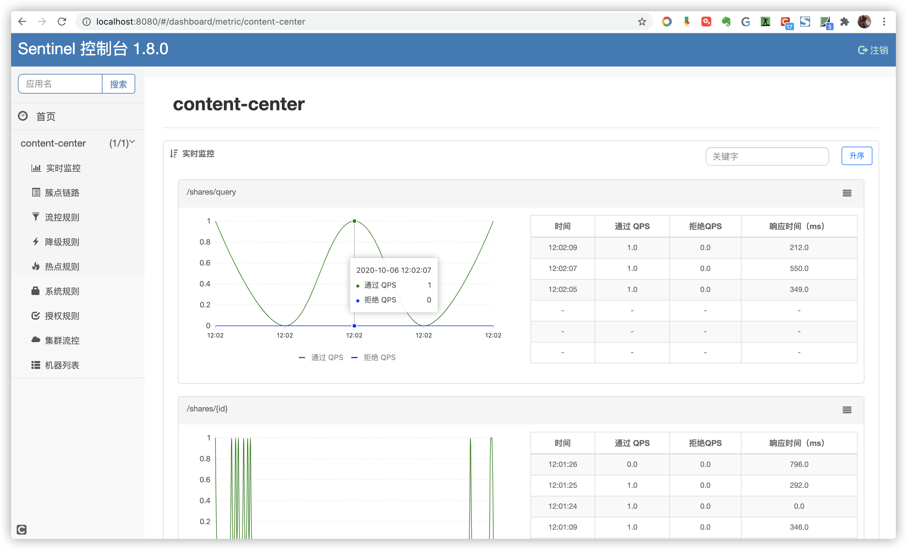

# springCloud学习笔记

## 单体架构Vs微服务架构

### 什么是单体架构

```
一个归档包包含所有的资源代码等等 程序成为单体应用,所依据得单体架构方法论为单体架构
下图单体架构：
```


```
优点：架构简单
缺点：复杂性高 部署慢(cpu 与Io 为指标 资源浪费)  拓展性差（单一项目一个语言） 开发受限制  阻碍技术创新（技术无法拓展）
```


### 微服务拆分

```java
DDD领域驱动设计(DDD:Domain-Driven Design)
https://blog.csdn.net/cywhoyi/article/details/84810675?utm_medium=distribute.pc_relevant.none-task-blog-BlogCommendFromMachineLearnPai2-2.channel_param&depth_1-utm_source=distribute.pc_relevant.none-task-blog-BlogCommendFromMachineLearnPai2-2.channel_param
---------------------------------------------------------------------------------------
 UML:统一建模语言
     充血模型
     贫血模型
     https://blog.csdn.net/u010955843/article/details/45337771
---------------------------------------------------------------------------------------
面向对象设计思想
    by name 名词拆分 状态 
    by verb 行为 动作拆分 具体实现功能 
-----------------------------------------------------------------------------------------
    拆分维度：满足业务需求
    
    --------------------------------------------------------------------------------------
    中台就是公共服务平台，数据中台就是将数据加工以后封装成一个公共的数据产品或服务。
```


### 微服务架构图


## 什么是微服务

微服务是马丁福勒提出的一个新的架构风格，将一个整体服务拆成一个个模块化的的服务，使这些服务更加独立。


### 微服务优缺点

```
微服务优点：技术栈不受限 部署简单  开发维护简单 单个服务启动较快  *****······			去中心化****
微服务缺点：运维要求高  分布式系统固有的复杂性（网络延迟）  重复劳动（）
```

### 微服务适合场景 以及不适合场景

```
适合：迭代快 大型项目 访问压力大
不适合：业务文档 迭代周期长
```

## springBoot与springCloud 版本选型

### 版本解析


### 服务


### 阿里巴巴


### 

### 整体流程


## Eureka搭建demo

### 什么是Eureka

```
Eureka 是服务注册发现  基于rest风格  基于cs模式
Eureka server 作为服务注册发现
```


### 准备工作：

```java
//首先父工程引入依赖
  <dependency>
                <groupId>org.springframework.boot</groupId>
                <artifactId>spring-boot-dependencies</artifactId>
                <version>${spring-boot-dependencies.version}</version>
                <!--                类型pom-->
                <type>pom</type>
                <scope>import</scope>
            </dependency>

            <dependency>
                <groupId>org.springframework.cloud</groupId>
                <artifactId>spring-cloud-dependencies</artifactId>
                <version>${spring-cloud-dependencies.version}</version>
                <!--                类型pom-->
                <type>pom</type>
                <scope>import</scope>
            </dependency>
      
      
 //子工程引入Eureka依赖 server端引入 server端依赖 Client引入Client依赖
      <dependency>
            <groupId>org.springframework.cloud</groupId>
            <artifactId>spring-cloud-starter-netflix-eureka-server</artifactId>
        </dependency>
      
      
      <dependency>
            <groupId>org.springframework.cloud</groupId>
            <artifactId>spring-cloud-starter-netflix-eureka-client</artifactId>
        </dependency>
      
    --------------------------------------------------------------------------------------
      Eureka配置详解  yml
      server:
  port: 7001
eureka:
  instance:
    hostname: 127.0.0.1
  client:
    # 是否要注册到其他的Eureka server 实例 如果是server端 就是false 不可注册 client端为true
    register-with-eureka: false
    # 是否要从其他Eureka Server实例获取数据 如果是server端 就是false 不可注册 client端为true
    fetch-registry: false
     # 动态拼接地址 默认地址为   http://localhost:8761/eureka/   
    service-url:
      defaultZone: http://${eureka.instance.hostname}:${server.port}/eureka/
```

## Nacos配置

```java
1.0 引入依赖
 <dependency>
            <groupId>com.alibaba.cloud</groupId>
            <artifactId>spring-cloud-starter-alibaba-nacos-discovery</artifactId>
        </dependency>
2.0 无注解
3.0 配置 yml
 spring:
   application: #必须配置名字
    name: wluser-center 
  cloud:
    inetutils:
      ignored-interfaces: eth.* #忽略网卡
      preferred-networks: 39.103.140.27 #固定公网ip
    nacos:
      discovery:
        server-addr: 39.103.140.27:8848 #配置远程Nacos地址
        metadata:
          instance: cc
          version: 1.0
```


## Actuator是什么

spring boot 中 类似监视器 与描述器配置 需要在yml 文件中配置 。可以配置服务信息 等等操作 ，

具体配置参考：

```java
https://blog.csdn.net/alinyua/article/details/80009435
```


##   RestTemplate的调用之服务提供者 服务消费者

restTemplate 是 spring提供的一个访问restful服务的类 。以下是一些具体实现类 

整个流程是 一个服务去调用另一个服务的过程，不过 将其注入Eureka 用Eureka来统一管理。

下图是restTemplate 定义一些方法。支持我们调用restful风格服务


## ribbon负载均衡学习

```
依赖在nacos引入时默认引入
没有任何配置
需要在配置restTemplate上加 @LoadBanced 注解
实现负载均衡 直接方法是算法 轮询 或者加权。
```


### ribbon 规则


### 自定义ribbon规则注意点

```
ribbon定义规则时候一定不能将 ribbion rule配置放在springboot主配置所在包中
需要在java 中另外定义包的配置
因为 主启动扫描会将配置ribbon规则扫描 造成父子都被扫描 （父子上下文事件） 会导致 *****事务配置无效****

```


### ribbon配置写法

```java
@Configuration
public class RuleConfig {
  @Bean
  public IRule getRule() {
    return new RandomRule();//指定规则
  }
}
***********************************************************************************************
@Configuration
@RibbonClient(name = "user-center",configuration = RuleConfig.class)//指定配置的class
public class RibbonConfig {
}
***********************************************************************************************

@Configuration
@RibbonClients(defaultConfiguration = RandomRule.class) #clients 指定策略
public class RibbonConfig {}


***********************************************************************************************
//也可以用yml方式去配置 参考下图
wluser-center: #服务名称
   ribbon:
     NFLoadBalancerRuleClassName: com.netflix.loadbalancer.RandomRule #策略
***********************************************************************************************
指定springboot注册 不需要扫描到你配置的策略类也可以
@ComponentScan(basePackages = "com.foo.bar", excludeFilters = {@ComponentScan.Filter(type = FilterType.ASSIGNABLE_TYPE, value = xxxx.class)})


https://blog.csdn.net/LightOfMiracle/article/details/82774780
```


### 饿汉式加载方法：

```
#开启方法
ribbon:
  eager-load:
    clients: wluser-center #服务名称
消除缓存    
    
```

### 命名空间：

#### 新建 nacos 


```
  cloud:
    nacos:
      discovery:
        server-addr: 39.103.140.27:8848
        metadata:
          instance: zz
          version: 0.1
        namespace: 350261b3-c37f-42f6-b02a-97586ffdfe29 #namespace配置
```

### Nacos权重配置

```
/**
 * @ClassName: NacosWeightRule @Description: TODO @Author: WangLinLIN @Date:
 * 2020/09/27 14:56:38  @Version: V1.0
 */
@Slf4j
@Configuration
public class NacosWeightRule extends AbstractLoadBalancerRule {
  @Resource private NacosDiscoveryProperties nacosDiscoveryProperties;

  @Override
  public void initWithNiwsConfig(IClientConfig iClientConfig) {
    // 读取配置文件
  }

  @Override
  public Server choose(Object o) {
    // 获取具体类
    BaseLoadBalancer baseLoadBalancer = (BaseLoadBalancer) this.getLoadBalancer();
    // 获取服务名称
    String name = baseLoadBalancer.getName();
    // 拿到服务发现相关Api
    NamingService namingService = nacosDiscoveryProperties.namingServiceInstance();
    // nacos自动负载均衡给我们选择一个实例
    try {
      Instance instance = namingService.selectOneHealthyInstance(name);
      log.info("选择实例： port:{},instance:{}", instance.getPort(), instance);
      return new NacosServer(instance);
    } catch (NacosException e) {
      e.printStackTrace();
    }
    return null;
  }
}

```


## OpenFeign的学习

什么是OpenFeign ：声明式服务调用 更加方便 调用 丢弃RestTemplate

```java
#1.0 pom 配置
***********************************************************************************************
    
    <!--        openFeign-->
		<dependency>
			<groupId>org.springframework.cloud</groupId>
			<artifactId>spring-cloud-starter-openfeign</artifactId>
		</dependency>
***********************************************************************************************
#2.0 配置类 (可以不配置)
同理与Ribbon相似有三种配置 
第一种 配置 写config配置类 但是头部无@Configuration 注解 这样可以避免父子上下文问题
第二种 在项目包在主启动类外部包 也就是同ribbon一样 去建一个config配置类  这样componentScan 就不会扫描到
第三种 （推荐） 项目配置一律选择 yml  OpenFeign配置可参考
//openFeign 官网
https://cloud.spring.io/spring-cloud-static/spring-cloud-openfeign/2.2.2.RELEASE/reference/html/
***********************************************************************************************
#3.0 主启动类 添加注解 @EnableFeignClients
***********************************************************************************************
//服务调用者需要编写代码  定义一个接口 xxxFegin  头上标明注解@FeignClient(name = "wluser-center") 
    name指定Nacos注册服务名称 （基于服务名称调用）
 //表明是哪个服务
@FeignClient(name = "wluser-center") 
public interface UserFeign {
    //写法类似于 在服务提供者 写的接口是什么请求就原封不动写
    
  @GetMapping(value ="/u1/{id}")
  User getUser(@RequestParam("id") Integer id);
}

这个有个坑 按理说 路径参数应该是 @PathVariable  但添加 @PathVariable 注解 来标明路径参数 会出现服务经过OpenFeign调用从Get转为Post 从而爆出405错误 
至于Post Get请求怎么定义 参考文章:
https://blog.csdn.net/justry_deng/article/details/80785973?utm_medium=distribute.pc_relevant.none-task-blog-BlogCommendFromMachineLearnPai2-2.channel_param&depth_1-utm_source=distribute.pc_relevant.none-task-blog-BlogCommendFromMachineLearnPai2-2.channel_param 
//解决办法
请求参数加入 @SpringQueryMap 
***********************************************************************************************
同名@FeignClient(name = "wluser-center")存在 需要在配置类指定
   spring    
      main:
        allow-bean-definition-overriding: true
***********************************************************************************************
    
#3.0 调用
 我们需要把我们上面写的 xxxFeign 注入到我们的所需要的类中 
 @Resource private  xxxFeign  xxxFeign; //注入需要的类中
 通过xxxFegin调用接口中的方法来实现服务RestTemplate调用

```


### feign日志

```java
//yml中配置
#fegin  顶层logging
logging:
  level:
    #feign的日志建立在Springboot基础上此处debug否则不打印
    com.wl.contentcenter.openFegin: debug
```


### Java代码配置


​	


### ***全局***配置Feign日志


#### Java代码


```
启动主类注解加上defaultConfiguration属性，指向配置类即可（基于语义，类名使用GlobalFeignConfiguration，代码同UserCenterFeignConfiguration）
```

#### yml配置方式


## 容错学习

### 常见容错方案：

```markdown
超时：为每个请求设置一个很短的时间。释放的够快
限流：设置QPS（每秒的请求的固定）  阈值  请求阈值
舱壁模式：为controller设置独立大小线程池  到达最大线程 拒绝请求
短路器模式：监控加开关 
```


### 引入Sentinel

#### Sentinel是什么：分布式系统的流量防卫兵


### 生态：


### sentinel整合

#### 1.0 sentinel文档地址

```java
https://github.com/alibaba/Sentinel/wiki/%E4%BB%8B%E7%BB%8D
```

### 2.0 整合Sentinel

```java
1.0//引入依赖
<dependency>
    <groupId>com.alibaba.cloud</groupId>
    <artifactId>spring-cloud-starter-alibaba-sentinel</artifactId>
 </dependency>
2.0// 注解无
3.0// 写配置==============================================================================================    
只要加上依赖，应用就整合好了Sentinel，那么，如何证明呢？
应用整合Sentinel后，会暴露一个“/actuator/sentinel”端点（默认是隐藏的，需要配置）
    //pom 引入
    management:
  endpoints:
    web:
      exposure:
        include: '*'
  endpoint:
    health:
      show-details: always
============================================================================================== 访问   http://localhost:端口/actuator/sentinel
          
```

### 3.0Sentinel控制台

```java
//Sentinel控制台
//搭建Sentinel控制台
下载地址：https://github.com/alibaba/Sentinel/releases
Sentinel控制台文档：https://github.com/alibaba/Sentinel/wiki/%E6%8E%A7%E5%88%B6%E5%8F%B0
============================================================================================== 1.0 //
java -Dserver.port=8080 -Dcsp.sentinel.dashboard.server=localhost:8080 -Dproject.name=sentinel-dashboard -jar sentinel-dashboard.jar
2.0//
整合应用&控制台
yml加入配置，指定sentinel控制台地址和端口
cloud:
    #默认和nacos同级
    sentinel:
      transport:
        #指定sentinel控制台位置
        dashboard: localhost:8080
============================================================================================== 
sentinel是懒加载，所以需要访问内容中心的API之后，才会有内容
需要调用几次content-center的接口后，再次刷新，才可以看到结果
```

#### 效果图



### 知识引入 QPS TPS  吞吐量 并发用户量 


### 流控规则（同一时间可以访问次数 ）

- 直接
- 关联
- 链路

### 新增流控规则：

#### 1.0新增直接：


### 1.1新增直接效果图


## **消息驱动的微服务-Spring Cloud Alibaba Rocket MQ**

### 异步处理

```java
Spring中实现异步等方法有：

AsyncRestTemplate
     参考文档：https://blog.csdn.net/jiangchao858/article/details/86709750

@Async注解
     参考文档：https://spring.io/guides/gs/async-method/

WebClient (Spring 5.0引入）
     参考文档：https://docs.spring.io/spring-framework/docs/5.2.9.RELEASE/spring-framework-reference/web-reactive.html#webflux-client
```

### 可用消息队列列举

```java
前三个都是SpringFramework自带的

MQ产品：RocketMQ、ActiveMQ、RabbitMQ、ZeroMQ、Kafka
==============================================================================================    
    MQ适用场景
异步处理：把一些耗时但是不阻塞主流程的业务放到MQ做异步处理，提升用户体验
流量削峰填谷：“秒杀”场景，开始的瞬间流量疯狂打入， 用MQ控制参加人数，
解耦微服务：A生产消息放到MQ，B到MQ消费消息
=============================================================================================  
消息队列对比参照表：https://blog.csdn.net/fxbin123/article/details/90261669
RocketMQ官方PK：http://rocketmq.apache.org/docs/motivation/
```

### 如何搭建RocketMQ 参考文档  docker 构建 from 王林

### 配置三板斧

```java
//引入依赖
   <!--rocket MQ-->
        <dependency>
            <groupId>org.apache.rocketmq</groupId>
            <artifactId>rocketmq-spring-boot-starter</artifactId>
            <version>2.1.1</version>
        </dependency>
=============================================================================================  
//无注解
=============================================================================================  
//引入spring .yml （rocketmq 顶层）
rocketmq:
  name-server: 123.57.51.43:9876 #服务的name-server地址
  producer:
    # 必须指定group（不然服务无法启动 group可以随意指定）
    group: test-group
```

### 代码实现 消息提供 消息监听

```java
//服务提供者
//需要消息传输地方 引入 rocketMQTemplate
 @Resource private RocketMQTemplate rocketMQTemplate;
//消息发送代码
 // 消息发送 # add-bonus 是自定义主题 与消息接收方需要一致
      rocketMQTemplate.convertAndSend(
          "add-bonus", UserAddBonusDto.builder().bonus(50).userId(share.getUserId()).build());
=============================================================================================  
//服务接受者 监听接收消息
//标注为service
@Service 
 //标记为消费者 主题为提供者定义主题   
@RocketMQMessageListener(consumerGroup = "consumer",topic = "add-bonus")
 //继承RocketMQListener 参数为消息体的Dto 重写OnMessage方法  
public class AddBonusListener implements RocketMQListener<MessageDto> {
//重写方法 实时监听方法    
 @Override    
public void onMessage(MessageDto messageDto) {
        do sth
    }
    }
```


## API网关

### 配置Api网关

```java
1.0//引入依赖
<dependency>
			<groupId>org.springframework.cloud</groupId>
			<artifactId>spring-cloud-starter-gateway</artifactId>
		</dependency>
=============================================================================================
2.0// GateWay配置	
    gateway:
      discovery:
        locator:
          # 让gateway通过服务发现组件找到其他的微服务
          enabled: true
      routes:
        - id : wu  #定义有意义id
          uri : lb://wluser-center #可为路径参数 
          predicates: #必须配置
            - Method=GET  #请求方法
            - After=2020-10-10T07:00:00.000+08:00[Asia/Shanghai]
参考:http://www.glmapper.com/2019/01/19/springcloud-gateway-predicate-project/ 
https://juejin.im/post/6844903982599684103
ps:请求方式两种 url可以为具体地址
               url 也可以写成 lb://{nacos注册服务名称}
=============================================================================================
    3.0调用时候
  localhost：{getway端口} /{各个服务具体地址}  
```


## 元数据置

```
1.0 spring 配置类 在yml配置metadata 
2.0 nacos控制台配置三个元数据  服务级别 集群级别 实例级别

```


## Alibaba生态学习 架构图 


## 微服务学习整理


## 9.0整理

```java
官方站点：
1、SpringCloud：https://spring.io/projects/spring-cloud
2、SpringCloud孵化器：https://github.com/spring-cloud-incubator
3、SpringCloud版本大全：https://github.com/spring-cloud/spring-cloud-release/releases
4、SpringCloudAlibaba：https://spring-cloud-alibaba-group.github.io/github-pages/hoxton/zh-cn/index.html
5、Nacos：https://nacos.io/zh-cn/index.html
6、MinIO（MinIO 是一个基于Apache License v2.0开源协议的对象存储服务）//替代oss：https://docs.min.io/cn/minio-quickstart-guide.html
7、Docker镜像大全：https://hub.docker.com/
8、Python库大全：https://pypi.org/

-------------------------------------------------------------------------------------------
阿里巴巴官方文档：https://github.com/alibaba/spring-cloud-alibaba/wiki/%E7%89%88%E6%9C%AC%E8%AF%B4%E6%98%8E
阅读：
\1. 微服务部署和发布：https://developer.aliyun.com/article/747091
\2. *******

资源和工具：
1、 ******
api文档
https://t.itmuch.com/doc.html
实践：
1、ECS CentOS环境安装：https://shimo.im/docs/wYThw9GwV6D8RqvJ/
-------------------------------------------------------------------------------------------
中央仓库
#Flutter
https://pub.dev/
#Gradle
https://mvnrepository.com/
#Maven
https://mvnrepository.com/
#NPM
https://www.npmjs.com/
#PIP
https://pypi.org/
#Docker
https://hub.docker.com/

```

